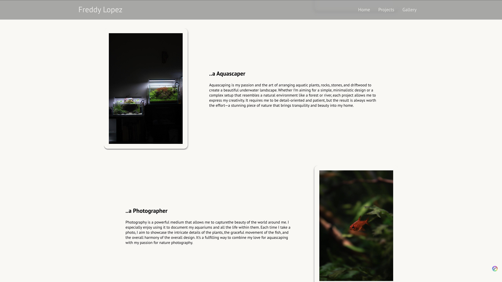
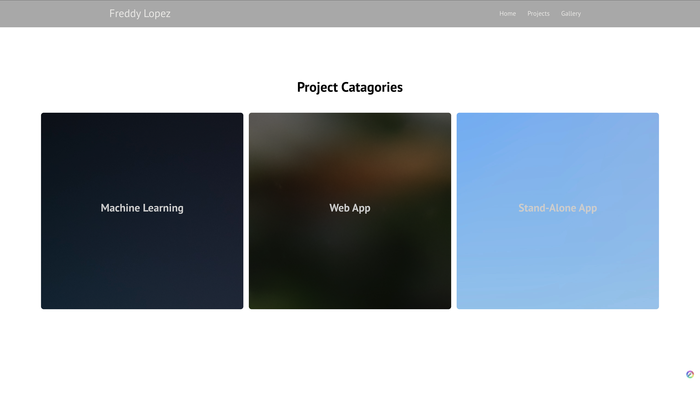
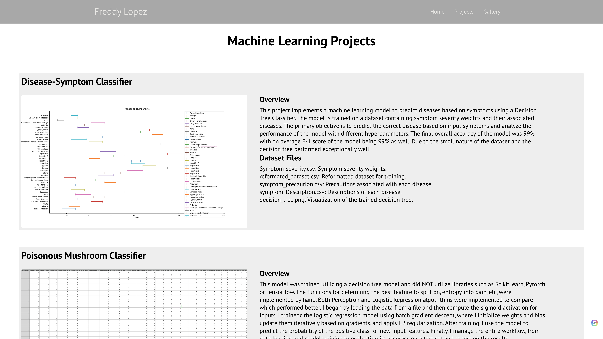

# Personal Website

Welcome to my personal website! This project is a modern, minimalistic React web application designed to showcase who I am as both a developer and a system administrator, as well as some of my personal hobbies and personality.

## About the Project

This website serves as my personal portfolio and professional hub, where I share my work in software development, system administration, and various personal projects. The design focuses on simplicity, making it easy to navigate and explore.

The app is built using React with a component-based architecture, promoting reusability and scalability. Each section is designed to reflect both my technical skills and my personal interests.

## Features

- **Component-based architecture**: Built using reusable components for scalability and maintainability.
- **Minimalistic design**: A clean, modern look with an emphasis on functionality and aesthetics.
- **Professional portfolio**: Highlights my experience in software development, system administration, and other relevant work.
- **Hobbies and personal interests**: Learn more about me outside of work, including photography and aquarium keeping.
- **Responsive layout**: Optimized for desktop and mobile devices, ensuring a seamless experience across platforms.

## Tech Stack

- **Frontend**: React, JavaScript, CSS
- **Build tools**: Node.js, Webpack, Babel
- **Other libraries**: React Router, custom animations, CSS Grid/Flexbox for responsive design

## Current previews

 
